# LATAM Bank – Entity Relationship Diagram

Source: `LATAM_Bank_Complete_Data_Dictionary (2).pdf` (Dataset v1.0.0, 13 tables). The tables, columns, primary keys and nullability below match `data_load/schema.sql`, the DDL the data pipeline loads into Aurora DSQL. Exact column types (`numeric(15,2)`, `varchar(30)`, `smallint`...) are in that file; the diagram uses generic types.

```mermaid
erDiagram
    %% ======================= RELATIONSHIPS =======================
    %% branches
    BRANCHES |o--o{ CUSTOMERS : "registers (registration_branch_id)"
    BRANCHES |o--o{ PRODUCTS : "opens (opening_branch_id)"
    BRANCHES |o--o{ SERVICE_AGENTS : "assigns (assigned_branch_id)"
    BRANCHES |o--o{ TRANSACTIONS : "hosts (branch_id)"
    BRANCHES |o--o{ COMPLAINTS : "relates to (related_branch_id)"

    %% customers
    CUSTOMERS ||--o{ PRODUCTS : "owns"
    CUSTOMERS ||--o{ TRANSACTIONS : "makes"
    CUSTOMERS ||--o{ CALL_CENTER_INTERACTIONS : "contacts"
    CUSTOMERS ||--o{ CALL_TRANSCRIPTS : "speaks in"
    CUSTOMERS |o--o{ SATISFACTION_SURVEYS : "answers"
    CUSTOMERS |o--o{ DIGITAL_EVENTS : "generates"
    CUSTOMERS ||--o{ COMPLAINTS : "files"
    CUSTOMERS ||--o{ CAMPAIGN_SENDS : "receives"

    %% products
    PRODUCTS ||--o{ TRANSACTIONS : "used in"
    PRODUCTS |o--o{ DIGITAL_EVENTS : "related to"
    PRODUCTS |o--o{ COMPLAINTS : "affected by (affected_product_id)"

    %% service agents
    SERVICE_AGENTS |o--o{ CALL_CENTER_INTERACTIONS : "attends"
    SERVICE_AGENTS ||--o{ CALL_TRANSCRIPTS : "speaks in"
    SERVICE_AGENTS |o--o{ SATISFACTION_SURVEYS : "evaluated in"
    SERVICE_AGENTS |o--o{ COMPLAINTS : "handles (assigned_agent_id)"

    %% marketing
    MARKETING_CAMPAIGNS ||--o{ CAMPAIGN_SENDS : "sent as"

    %% call center interactions
    CALL_CENTER_INTERACTIONS ||--o{ CALL_TRANSCRIPTS : "transcribed as"
    CALL_CENTER_INTERACTIONS ||--o{ SATISFACTION_SURVEYS : "evaluated by"
    CALL_CENTER_INTERACTIONS |o--o{ COMPLAINTS : "originates (origin_interaction_id)"

    %% ======================= DIMENSIONS =======================
    CUSTOMERS {
        varchar customer_id PK
        varchar document_number "unique per dictionary, not enforced"
        varchar document_type
        varchar first_name
        varchar last_name
        date date_of_birth
        varchar gender
        varchar email
        varchar mobile_phone
        varchar landline_phone
        varchar address
        varchar city
        varchar state
        varchar country
        varchar postal_code
        varchar detected_accent
        varchar segment "Premium, Plus, Basic, Student"
        int credit_score
        decimal estimated_monthly_income
        varchar occupation
        varchar marital_status
        varchar education_level
        timestamp registration_date
        varchar registration_branch_id FK
        varchar customer_status
        timestamp last_updated
        boolean accepts_marketing
    }

    PRODUCTS {
        varchar product_id PK
        varchar customer_id FK
        varchar product_type "CHECK enum"
        varchar product_number "unique per dictionary, not enforced"
        varchar currency
        decimal current_balance
        decimal credit_limit
        decimal interest_rate
        date opening_date
        date expiration_date
        varchar opening_branch_id FK
        varchar product_status "CHECK enum"
        varchar opening_channel
        boolean has_linked_app
        int days_past_due
        timestamp last_transaction_date
        timestamp last_updated
    }

    BRANCHES {
        varchar branch_id PK
        varchar branch_code "unique per dictionary, not enforced"
        varchar branch_name
        varchar branch_type
        varchar address
        varchar city
        varchar state
        varchar country
        varchar postal_code
        varchar geographic_zone
        varchar phone
        varchar email
        time opening_time
        time closing_time
        boolean has_atms
        int atm_count
        boolean has_teller_windows
        int teller_window_count
        decimal latitude
        decimal longitude
        date branch_opening_date
        varchar branch_status
    }

    SERVICE_AGENTS {
        varchar agent_id PK
        varchar employee_code "unique per dictionary, not enforced"
        varchar first_name
        varchar last_name
        varchar email
        varchar phone
        varchar native_accent
        varchar country_of_origin
        varchar assigned_branch_id FK
        varchar agent_type
        varchar experience_level
        varchar languages
        varchar specialty
        date hire_date
        decimal avg_csat
        int total_monthly_interactions
        varchar agent_status
        varchar work_shift
    }

    MARKETING_CAMPAIGNS {
        varchar campaign_id PK
        varchar campaign_name
        text description
        varchar campaign_type
        varchar campaign_objective
        varchar promoted_product
        varchar target_segment
        varchar target_country
        date start_date
        date end_date
        decimal budget
        varchar campaign_status
        decimal expected_conversion_rate
    }

    %% ======================= FACTS =======================
    TRANSACTIONS {
        varchar transaction_id PK
        timestamp transaction_date
        date process_date "source partition key"
        varchar product_id FK
        varchar customer_id FK
        varchar transaction_type
        varchar transaction_category
        decimal amount
        varchar currency
        decimal amount_usd
        varchar channel
        varchar branch_id FK
        varchar merchant_name
        varchar merchant_category
        varchar transaction_country
        varchar transaction_city
        varchar transaction_status "CHECK enum"
        varchar response_code "CHECK enum"
        boolean is_fraud
        decimal fraud_score
        decimal latitude
        decimal longitude
    }

    CALL_CENTER_INTERACTIONS {
        varchar interaction_id PK
        timestamp interaction_date
        date process_date "source partition key"
        varchar customer_id FK
        varchar agent_id FK
        varchar interaction_type
        varchar channel
        varchar contact_reason
        varchar reason_category
        int duration_seconds
        int wait_time_seconds
        boolean was_resolved
        boolean requires_followup
        varchar detected_sentiment
        decimal sentiment_score
        varchar customer_detected_accent
        varchar agent_used_accent
        boolean was_escalated
        varchar mentioned_products "comma-separated product_ids"
        boolean has_transcript
        boolean has_recording
    }

    CALL_TRANSCRIPTS {
        varchar transcript_id PK
        varchar interaction_id FK
        date process_date "source partition key"
        varchar customer_id FK
        varchar agent_id FK
        text full_text
        text customer_text
        text agent_text
        varchar detected_language
        varchar detected_accent
        decimal accent_confidence
        varchar detected_keywords
        text mentioned_entities "JSON"
        varchar detected_intents
        varchar main_topics
        varchar transcription_model
        varchar audio_quality
        int duration_seconds
    }

    SATISFACTION_SURVEYS {
        varchar survey_id PK
        timestamp survey_date
        date process_date "source partition key"
        varchar interaction_id FK
        varchar customer_id FK
        varchar agent_id FK
        varchar survey_type "CSAT, NPS, CES"
        varchar send_channel
        int main_score
        varchar nps_category
        text question_1_text
        int question_1_response
        text question_2_text
        int question_2_response
        text question_3_text
        int question_3_response
        text open_comments
        varchar comment_sentiment
        decimal response_time_hours
        decimal campaign_response_rate
    }

    DIGITAL_EVENTS {
        varchar event_id PK
        timestamp event_date
        date process_date "source partition key"
        varchar customer_id FK
        varchar session_id
        varchar event_type
        varchar event_category
        varchar channel
        varchar platform
        varchar browser
        varchar app_version
        varchar page_url
        varchar page_title
        varchar action
        varchar element_id
        varchar product_id FK
        decimal event_value
        int duration_seconds
        varchar ip_address
        varchar ip_country
        varchar ip_city
        boolean is_mobile
        varchar referrer
        varchar utm_source
        varchar utm_medium
        varchar utm_campaign
    }

    COMPLAINTS {
        varchar complaint_id PK
        timestamp creation_date
        date process_date "source partition key"
        varchar customer_id FK
        varchar case_type "Complaint, Claim, Request, Suggestion"
        varchar category "CHECK enum"
        varchar subcategory
        varchar reception_channel "CHECK enum"
        varchar affected_product_id FK
        varchar related_branch_id FK
        varchar origin_interaction_id FK
        text description
        decimal claimed_amount
        varchar currency
        varchar priority
        varchar status
        varchar assigned_agent_id FK
        timestamp assignment_date
        timestamp first_response_date
        timestamp resolution_date
        timestamp closing_date
        boolean sla_breached
        int resolution_days
        text resolution
        decimal compensation_granted
        int resolution_satisfaction
        boolean is_repeat_complainer
    }

    CAMPAIGN_SENDS {
        varchar send_id PK
        timestamp send_date
        date process_date "source partition key"
        varchar campaign_id FK
        varchar customer_id FK
        varchar send_channel
        varchar template_used
        varchar subject
        varchar send_status
        boolean was_delivered
        boolean was_opened
        timestamp open_date
        boolean was_clicked
        timestamp click_date
        int click_count
        boolean had_conversion
        timestamp conversion_date
        decimal conversion_value
        varchar open_device
        varchar open_country
        varchar failure_reason
        decimal send_cost
    }

    %% ======================= REFERENCE =======================
    DAILY_EXCHANGE_RATES {
        date date PK
        varchar source_currency PK
        varchar target_currency PK
        decimal exchange_rate
        decimal buy_rate
        decimal sell_rate
        varchar source
    }
```

## Notes

- **Cardinality:** `||--o{` means the FK column is `NOT NULL` in `schema.sql` (each child row always has a parent). `|o--o{` means it is nullable (optional parent). `customers.registration_branch_id` is nullable because repair R1 sets a broken link to `NULL` when no branch can be proven.
- **Keys:** `FK` marks the dictionary's logical links; DSQL has **no foreign key constraints** (pipeline decision D6). Instead, the transform checks all 24 links in DuckDB before the load and repairs the broken ones in place (R1–R6 in `data_load/repair.py`): an unprovable link becomes `NULL`, and no row is deleted. The run fails if a link, an ownership rule (a row's product must belong to the row's customer) or a date order still breaks. Primary keys are enforced, in DuckDB during the transform and in DSQL.
- **Unique columns:** the dictionary marks `customers.document_number`, `products.product_number`, `branches.branch_code` and `service_agents.employee_code` as unique. `schema.sql` declares no `UNIQUE` constraint on them, so nothing enforces it.
- **`process_date`:** the dictionary's partition key for the fact tables, which the source files are split by. DSQL has no table partitions: the tools only use `process_date` to bound their scans.
- **`CHECK` enums** (`schema.sql`), which hold on the full data:

  | Column | Values |
  |---|---|
  | `products.product_type` | `Cuenta Ahorro`, `Tarjeta Crédito`, `Cuenta Corriente`, `Tarjeta Débito`, `Préstamo Personal`, `Préstamo Hipotecario`, `Inversión`, `Seguro` |
  | `products.product_status` | `Active`, `Blocked`, `Closed`, `Suspended` |
  | `transactions.transaction_status` | `Approved`, `Declined`, `Pending`, `Reversed` |
  | `transactions.response_code` | `00`, `05`, `14`, `51`, `54` (or null) |
  | `complaints.category` | `Branch`, `Fees`, `Service`, `Technical`, `Transactions` |
  | `complaints.reception_channel` | `Call Center`, `Email`, `Web`, `App`, `Branch`, `Regulator` |

  The other value lists in the diagram (`segment`, `survey_type`, `case_type`) come from the dictionary and aren't constrained.
- **`DAILY_EXCHANGE_RATES`** has no declared FK. Join it logically on `date` + `currency` (for example `transactions.currency` → `source_currency`, with `transaction_date::date` → `date`).
- **`call_center_interactions.mentioned_products`** is a comma-separated list of `product_id`s. It's an implicit many-to-many link to `PRODUCTS`, not a real FK.
- **Data quality (per dictionary):** about 2% duplicate rows, about 5% nulls in nullable fields, and a small percentage of orphan FKs. In the loaded data the primary keys rule out duplicate ids, and the repairs above leave no broken link.
- **What is loaded:** all 13 tables, in the `public` schema, but only a curated subset of customers: 1,500 coherent customers plus a defect cohort of 159 kept as delivered, with all their rows, and the four tables with no customer link (`branches`, `service_agents`, `marketing_campaigns`, `daily_exchange_rates`) whole. Digital events with no customer are dropped. See the [curate stage spec](superpowers/specs/2026-10-03-curate-stage-design.md).
- **Access:** two database roles, mapped to IAM roles by the load. `ll_read` (the read tools) has `SELECT` on every table. `ll_write` (`block_credit_card`, `open_claim`) has `SELECT` on `products`, `transactions` and `complaints`, `UPDATE` on `products` and `INSERT` on `complaints`.
- **Indexes:** besides the primary keys, three secondary indexes for the tools' queries: `transactions (customer_id, transaction_date)`, `products (customer_id)` and `complaints (customer_id, creation_date)`.
