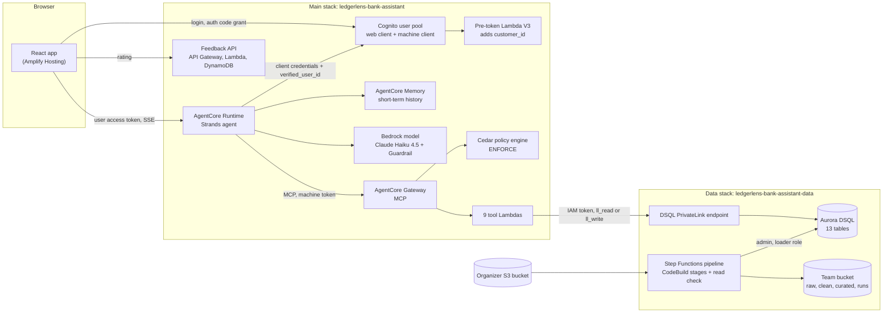

# Architecture

LedgerLens is a credit-card customer-service agent for a LATAM bank. A customer signs in, chats in Spanish, Portuguese or English, and the agent explains charges and declines, blocks a card, opens a fraud claim or hands the chat to a person. It is built on the AWS "Fullstack AgentCore Solution Template" (FAST) and deploys as two CDK stacks:

- **`ledgerlens-bank-assistant-data`**: Aurora DSQL, the private network path to it, the tool IAM roles and the pipeline that loads it.
- **`ledgerlens-bank-assistant`**: the React frontend on Amplify, Cognito, the agent on AgentCore Runtime, its Memory and Gateway, the Cedar policy, the 9 tool Lambdas, the Bedrock Guardrail and a feedback API.

The design rests on one rule: **the model never decides whose data it reads or whether an action runs.** The customer id comes from the login, a hook writes it into every tool call, Cedar checks it at the Gateway and the SQL filters on it again. Writes run only after the customer taps Yes.

The full resource list, names and IDs are in [DEPLOYMENT.md](DEPLOYMENT.md#what-each-stack-creates). The reasons behind each choice are in [decisions.md](decisions.md).

## Overview

`human_agent_hand_off` is the one tool that doesn't reach DSQL: it runs outside the VPC and calls no AWS service.

## Components

| Component | Code | Responsibility |
|---|---|---|
| Frontend | `frontend/src` | React 19 + Vite + TypeScript. OIDC login (`react-oidc-context`), chat UI, streaming client for the runtime (`lib/agentcore-client`), Yes/No cards (`components/chat/ConfirmCard.tsx`), the hand-off ticket and human agent desk (`HandOffTicket.tsx`, `AgentDesk.tsx`, `lib/handoff.ts`), copy in es/pt/en (`lib/i18n.tsx`) |
| Amplify Hosting | `infra-cdk/lib/amplify-hosting-construct.ts` | Serves the built SPA. Manual-deploy app (no Git connection). Sends a CSP that limits `connect-src` to Cognito, the AgentCore endpoint and API Gateway, because the login tokens live in `localStorage` |
| Cognito | `infra-cdk/lib/cognito-construct.ts` | User pool (no self sign-up, Essentials plan), a public web client for the authorization code grant, a confidential machine client for the Gateway, the `evaluators` group, and the V3 pre-token Lambda |
| Pre-token Lambda | `infra-cdk/lambdas/pretoken-v3/index.py` | On client-credentials tokens only: reads `verified_user_id` from the client metadata, looks it up in `USER_CUSTOMER_IDS_MAP` and adds `customer_id` (blank when unmapped) to the machine token |
| Agent | `agent/ledgerlens/ledgerlens_agent.py`, `agent/ledgerlens/tools/`, `agent/utils/auth.py` | One Strands `Agent` built per request on AgentCore Runtime (ARM64 container, JWT authorizer). Fetches the Gateway token, builds the system prompt and session context, attaches the hooks and streams the reply |
| AgentCore Memory | `backend-construct.ts` (`AgentMemory`), `tools/conversation_memory.py` | Conversation history per (user, session), 30-day expiry. The agent sends the last 30 messages to the model; summarization and long-term retrieval are off |
| Model + Guardrail | `config.yaml` `model_id`, `infra-cdk/lib/utils/agent-guardrail.ts`, `tools/guardrail.py` | `global.anthropic.claude-haiku-4-5-20251001-v1:0` at temperature 0.1. The guardrail blocks prompt attacks, harmful content and four off-topic groups, and masks nothing |
| AgentCore Gateway | `backend-construct.ts` (`createAgentCoreGateway`) | MCP server (protocol `2025-03-26`) in front of the tools. Its JWT authorizer accepts only the machine client. One Lambda target per tool |
| Cedar policy | `gateway/policies/policy.cedar`, `infra-cdk/lambdas/cedar-policy` | Policy engine attached in `ENFORCE` mode. Decides every `tools/call` from the machine token's claims and the tool's arguments |
| Tool Lambdas | `gateway/tools/<tool>/` | One Lambda per tool, Python 3.13 on ARM64, each a self-contained clean-architecture package. The 8 DSQL tools run in the data stack's VPC |
| Aurora DSQL | `infra-cdk/lib/data-construct.ts`, `data_load/schema.sql` | The only store for bank data: 13 tables in `public`, reachable only from the VPC through a PrivateLink endpoint |
| Data pipeline | `data_load/`, `data-construct.ts` | Step Functions: Ingest → Transform → Curate → Load (CodeBuild) → ReadCheck (Lambda). Turns the organizer's 5.3 GB of CSV into a curated, checked dataset |
| Feedback API | `backend-construct.ts` (`createFeedbackApi`), `infra-cdk/lambdas/feedback` | Thumbs up/down from the chat: API Gateway with a Cognito authorizer, a Lambda and a DynamoDB table. Kept from FAST |
| Evaluation harness | `evals/` | Runs scripted cases against the deployed agent from a laptop, grades them in code, scores them with AgentCore Evaluations and publishes a CloudWatch dashboard |

### The tools

| Tool | What it does | DSQL role |
|---|---|---|
| `get_session_context` | Profile, cards, last-72-hour transactions with risk flags, last-24-hour app/web signals, open cases | `ll_read` |
| `classify_call_type` | Up to 3 likely reasons for the contact, each with the record it points to and its evidence | `ll_read` |
| `list_credit_cards` | The customer's credit cards in every status, active first, at most 25 | `ll_read` |
| `list_card_transactions` | Searches transactions by card, dates, merchant, amount and status; newest first, at most 25 | `ll_read` |
| `explain_transaction` | One charge: FX rate and converted amount, decline meaning, `contradicts_card_state`, 90-day habit, nearest app session | `ll_read` |
| `transaction_fraud_detection` | Verdict `fraud` / `review` / `no_fraud` from the stored `fraud_score` (bands above 50 and above 30) | `ll_read` |
| `block_credit_card` | Blocks one card with a guarded `UPDATE`; repeating it reports `already_blocked` | `ll_write` |
| `open_claim` | One claim per card and currency, id `CMP-` + a content hash, plus a resolution estimate from similar claims | `ll_write` |
| `human_agent_hand_off` | Validates the hand-off and gives it an id `HO-` + a content hash. Stores and sends nothing | none |

## How a chat turn travels

1. **Login.** The browser runs the Cognito authorization code grant through the hosted UI (`lib/auth.ts`). Tokens are kept in `localStorage`.
2. **Request.** `AgentCoreClient.invoke` (`lib/agentcore-client/client.ts`) POSTs `{prompt, runtimeSessionId}` to `https://bedrock-agentcore.<region>.amazonaws.com/runtimes/<arn>/invocations` with the user's access token. The session id is a UUID per chat. The user id is never sent in the body.
3. **Runtime authorization.** The runtime's JWT authorizer validates the token against the user pool and the web client. Only the `Authorization` header is allowlisted through to the agent.
4. **Identity.** `invocations()` reads the claims without re-verifying them (the runtime already did) and takes `sub` as the user id (`extract_user_id_from_context`).
5. **Evaluation override.** `resolve_eval_settings` (`tools/eval_override.py`) returns the default model and prompt, unless the caller is in the `evaluators` group and asks for an allowlisted model or a different base prompt. Anyone else's `eval` field is ignored.
6. **Gateway token.** `get_gateway_access_token(sub)` calls Cognito's `/oauth2/token` directly with the machine client's credentials (from SSM and Secrets Manager) and `aws_client_metadata={"verified_user_id": sub}`. Cognito runs the pre-token Lambda, which adds `customer_id` from `USER_CUSTOMER_IDS_MAP`. One token is fetched per request.
7. **Customer id.** `extract_customer_id_from_token` reads `customer_id` from that same token. Blank means the login isn't linked to a customer: the prompt says so and the tool calls are cancelled.
8. **Agent assembly.** `create_strands_agent` builds a `BedrockModel` with the guardrail, an `AgentCoreMemorySessionManager` (actor = `sub`, session = `runtimeSessionId`, which restores messages and `agent.state`), the Gateway `MCPClient` with the machine token, the windowed conversation manager, and the hooks `CustomerIdHook` then `ConfirmationHook`.
9. **Session context.** `apply_session_context` (`tools/session_context.py`) looks for `session_context` in `agent.state`. On the first turn it calls `get_session_context` and `classify_call_type` in parallel straight from the tool registry, saves both results there, and renders them into the system prompt as JSON inside `<session_context>` tags. Later turns reuse the saved copy. A failed fetch saves nothing and is retried next turn.
10. **System prompt.** `build_system_prompt` joins the base prompt (`BASE_SYSTEM_PROMPT`, `PROMPT_VERSION = "v12"`), the customer block and the session context. `<` and `>` inside the context JSON are escaped, so database text can't close the tag.
11. **Model call.** Strands streams the turn through Bedrock. The guardrail checks only the newest customer message, holds each reply chunk until it is checked, and replaces a blocked message with fixed text in the three languages.
12. **Tool call.** Before each call, `CustomerIdHook` overwrites `customer_id` with the token's value, whatever the model wrote. `ConfirmationHook` pauses the three action tools (below). The MCP client sends `tools/call` to the Gateway as `gateway_<target>___<tool>`.
13. **Gateway and Cedar.** The Gateway validates the machine JWT, maps its claims to Cedar principal tags, and evaluates the policy against `context.input` (the tool arguments). An allowed call invokes the tool's Lambda with the arguments as the event.
14. **Tool Lambda.** The handler checks the tool name in the client context, runs its use case (which filters on `customer_id` in SQL again), and returns `{"content": [{"type": "text", "text": <JSON>}]}` or `{"error": <agent-facing message>}`.
15. **Streaming back.** Every Strands event goes through `LeakedMarkupFilter`, which strips raw tool-call markers some models (DeepSeek V3.2) leak into text, then out as SSE. The frontend's Strands parser (`parsers/strands.ts`) turns them into text, tool-call and confirmation events for the chat to render.
16. **Persistence.** The session manager saves the new messages, the conversation manager state and `agent.state` to AgentCore Memory. The system prompt isn't saved, which is why it is rebuilt every turn.

### Confirmation round trip

`block_credit_card`, `open_claim` and `human_agent_hand_off` never run on the model's word alone (`tools/confirmation_hook.py`):

1. The model calls the tool. `ConfirmationHook` raises a Strands interrupt named `confirm_<tool>`, with the tool name, its `toolUseId` and the arguments minus `customer_id` and `customer_confirmed`.
2. The agent stops with `stop_reason: "interrupt"`. The runtime yields a `{"confirmation": {...}}` event. The interrupt and the waiting tool call are saved with the session.
3. The frontend shows a `ConfirmCard` and locks the composer. A card block adds a simulated biometric step after Yes.
4. The click is the next request: `{"prompt": ..., "confirmations": [{"interruptId", "approved"}]}`. The runtime sees the active interrupt and resumes with `resume_prompt` instead of the text.
5. **Yes** runs the saved call. For a block or a claim, the hook sets `customer_confirmed: true`, so the value Cedar checks comes from the click. **No** cancels it with a message telling the model not to retry. A typed reply instead of a click also counts as No and reaches the model as the customer's words.

### Hand-off

`human_agent_hand_off` validates the reason, priority, summary and related ids and returns them with a `HO-` id. No queue or database is involved. The frontend (`lib/handoff.ts`) finds the completed result in the stream, waits for the goodbye to finish plus 600 ms, and splits the screen: the customer's chat on the left, a human agent desk ("Laura") on the right, where the presenter types as the agent. A failed hand-off never switches the UI.

## Security model

Three independent layers guard customer data, and a fourth guards actions:

| Layer | Mechanism | What it stops | Code |
|---|---|---|---|
| 1. Login | Cognito authorization code grant; the runtime's JWT authorizer; `sub` taken from the validated token, never from the body | Anonymous calls; impersonation through the payload | `cognito-construct.ts`, `backend-construct.ts`, `agent/utils/auth.py` |
| 2. Customer binding | Pre-token Lambda adds `customer_id`; `CustomerIdHook` overwrites it on every call; Cedar statement 1 requires a non-empty `customer_id`, statement 2 forbids any call whose `customer_id` argument differs from the claim; each SQL query filters on it | A prompt-injected or mistyped customer id; an unlinked login using any tool | `pretoken-v3/index.py`, `tools/customer_id_hook.py`, `gateway/policies/policy.cedar`, `queries/postgresql/*.sql` |
| 3. Database | `ll_read` (SELECT only) and `ll_write` (UPDATE `products`, INSERT `complaints`) mapped to the two tool IAM roles; only those roles have `dsql:DbConnect`; a cluster policy denies connections that don't come through the VPC, except the loader role | A leaked tool token writing data; anyone outside the VPC connecting, admin credentials on a laptop included | `data-construct.ts`, `data_load/schema.sql` |
| 4. Actions | `ConfirmationHook` pauses the three action tools until a Yes click; Cedar statement 3 forbids `block_credit_card` and `open_claim` unless `customer_confirmed` is `true` | The model blocking a card, opening a claim or handing off without consent | `tools/confirmation_hook.py`, `policy.cedar` |

Other controls:
- **Guardrail and prompt.** The guardrail blocks prompt attacks and off-topic requests. The prompt's privacy rules keep flags, scores, fraud verdicts and internal codes from the customer, show cards only by their last 4 digits, and treat tool results and `<session_context>` as data, never as instructions.
- **Error hygiene.** Tool Lambdas return only fixed domain-error messages; raw exception text (SQL, hosts, driver output) is logged, never returned to the model.
- **Agent permissions.** The runtime role has no DSQL permission. Code Interpreter isn't attached.
- **Organizer keys.** They live only in Secrets Manager and are fetched by the ingest stage at runtime, never put in an environment variable, a file or a log.

Known limits, recorded in the code and specs:
- The tools run in the account's **default VPC**, so anything else in it passes the cluster policy's `aws:SourceVpc` check; IAM and the database roles carry that case. The account root user and any principal allowed `dsql:PutClusterPolicy` can lift the network layer.
- `USER_CUSTOMER_IDS_MAP` is hard-coded in `cognito-construct.ts` and resets on every redeploy: demo-grade identity linking.
- The DSQL connection uses `sslmode=require`, which doesn't verify the server certificate (`TODO R11` in `utils/connectors/dsql.py`).

## Patterns

### Clean architecture in every tool Lambda

Each tool folder is a hexagonal application of its own (`gateway/tools/<tool>/<tool>_lambda/`):

- **`domain/`**: frozen dataclasses for entities and value objects, domain services, and `DomainError` subclasses whose messages tell the agent what to do next.
- **`application/`**: the use case plus its ports, `DatabaseRepository` (run a named-parameter query) and `QueryProvider` (load SQL text by name), and the port errors adapters must raise.
- **`infrastructure/`**: `DsqlRepository` (psycopg, SQLSTATE to port errors) and `FileQueryProvider`, which reads `queries/postgresql/<name>.sql` once per container and accepts only `[a-z0-9_]+` names.
- **`utils/connectors/`**: `PsycopgConnector` owns the cached connection's lifecycle; `DsqlConnector` only says how to open one.
- **`delivery/`**: `settings.py` (environment to typed settings), `dependencies/dependencies_builder.py` (the only place objects are built, once per cold start), presenters (entities to JSON, amounts as 2-decimal strings) and `handler.py`.

The use case never sees SQL text or a driver, so changing the engine means a new connector, repository and dialect folder, selected by `DB_ENGINE`. Code is copied between tools, never imported across folders: one folder is exactly one Lambda asset. [Structure](structure.md#layers-inside-a-tool-lambda) has the rules for each layer.

### Hooks around the model

The agent's guarantees don't depend on the prompt being obeyed. Strands `BeforeToolCallEvent` hooks rewrite or pause tool calls (`CustomerIdHook`, `ConfirmationHook`), a stream filter cleans output (`LeakedMarkupFilter`), and a gate decides evaluation overrides (`resolve_eval_settings`). Each is a small module under `agent/ledgerlens/tools/` with its own unit test.

### Prompt versioning

`PROMPT_VERSION` names the prompt template, and `tests/unit/test_system_prompt.py` pins the template's SHA-256 for each version, so an edit without a version bump fails CI. The version goes on every agent span (`prompt.version`) and in one `[PROMPT]` log line per request, next to `model.id`.

### Staged pipeline with run records

Each data stage reads the previous stage's output from S3, checks everything before writing, and records what it did in `runs/<run-id>/<stage>.json`. `data_load/schema.sql` is the contract in both DuckDB and DSQL. `data_load/expected.json` pins every row and repair count, so a run on the full data that drifts fails. Any stage can be rerun alone for the same run id.

### Idempotent writes

Every write is a single autocommit statement that is safe to repeat: blocking uses an `UPDATE` guarded on the current status, and claim and hand-off ids are hashes of their content. That makes a retry after a lost connection or a DSQL conflict harmless, and turns a repeated model call into `already_blocked` / `already_existed` instead of a duplicate.

## Database interaction

**Engine.** Aurora DSQL speaks PostgreSQL, so the tools use psycopg 3 and the SQL lives in `queries/postgresql/`. DSQL differs from PostgreSQL in ways the code works around: no foreign keys, no `TRUNCATE`, no `statement_timeout` or `default_transaction_read_only`, indexes only through `CREATE INDEX ASYNC`, optimistic concurrency, connections closed after 60 minutes and transactions capped at 300 s.

**Connections** (`utils/connectors/dsql.py`, `base.py`):
- One connection cached per Lambda container, opened eagerly at cold start (a failure there is only logged and retried on the first query).
- The password is an IAM auth token signed locally with `generate_db_connect_auth_token` for the private host, new on every connect. A token is checked only at connect time, so an open connection outlives it.
- `sslmode=require`, `client_encoding=utf8` (accented merchant names), `connect_timeout=5`, `autocommit=True`, `dict_row`.
- Recycled after 55 minutes, before DSQL closes it.

**Roles and grants** (`data_load/schema.sql`, `dsql.py`):
- `ll_read`: `SELECT` on all 13 tables. Used by the six read tools and the read check (default `DSQL_DB_USER`).
- `ll_write`: `SELECT` on `products`, `transactions`, `complaints`; `UPDATE` on `products`; `INSERT` on `complaints`. Used by `block_credit_card` and `open_claim`, whose settings default to `ll_write` and never fall back to `ll_read`.
- The load stage maps each role to its IAM role with `AWS IAM GRANT` and reapplies the grants, because recreated tables lose them. The `access` stage does the same on a loaded cluster without touching data.
- DSQL refuses read-only sessions, so these grants are the only write guard.

**Errors and retries** (`infrastructure/repositories/dsql_repository.py`):

| Failure | Read tools | Write tools |
|---|---|---|
| Lost or refused connection (`OperationalError`, including `53300`/`53400`) | Reset the connection and retry once, then `DataSourceConnectionError` | Same |
| Query limit: SQLSTATE class `53` or `54` (128 MiB per query, 300 s per transaction) or `57014` | `QueryLimitExceededError`, never retried | Same |
| `40001`, DSQL's optimistic-concurrency conflict | Can't happen (SELECT only) | Rerun on the same connection after a 50-150 ms × n jittered sleep, at most 3 attempts, then `WriteConflictError` |
| `23505`, unique violation | n/a | `DuplicateKeyError`, never retried; `open_claim` reports the existing claim |
| Any other `psycopg.Error` | `QueryExecutionError` | Same |

The use case turns each port error into a domain error with a fixed message, such as "temporarily unavailable, offer to retry or hand off" or "don't retry; offer a hand-off". The retry after a lost connection is safe for writes only because every write is idempotent.

**Time.** The data ends on 2026-06-17, so every DSQL tool gets `AS_OF=2026-06-17T23:59:59` (`config.yaml` `data.as_of`) as its "now". Event queries filter on `process_date`, not `transaction_date`, because the bank's business day ends at 06:00.

**No per-query timeout.** DSQL rejects `statement_timeout`, so the tool Lambdas have a 30 s timeout (10 s for the hand-off) and DSQL's own 300 s transaction cap is the backstop.

**Indexes.** Three secondary indexes, built after each load for the read tools' queries: `transactions (customer_id, transaction_date)`, `products (customer_id)`, `complaints (customer_id, creation_date)`.

## Data pipeline

The organizer's dataset (7,671 CSV files, 23,495,188 rows, in a bucket in us-east-2) reaches DSQL through five stages, chained by the Step Functions state machine `ledgerlens-data-pipeline`. The execution name is the run id.

| Stage | Runs on | Does | Writes |
|---|---|---|---|
| Ingest | CodeBuild (`STAGE=ingest`) | Fetches the organizer's keys from Secrets Manager, copies every file byte for byte, checks sizes, records ETags and an ETag digest | `raw/<run-id>/`, `runs/<run-id>/ingest.json` |
| Transform | CodeBuild | Loads the CSVs as text into DuckDB tables built from `schema.sql` (types, `NOT NULL`, `CHECK`, primary keys), checks `varchar` lengths, applies repairs R1-R6, checks all 24 declared links, ownership and date order | `clean/<run-id>/*.parquet` + SHA-256, `transform.json` |
| Curate | CodeBuild | Applies rules C1-C12 to every row, selects 1,500 coherent customers (125 per country × segment cell, 10 pinned personas first) and a 159-customer defect cohort kept as delivered | `curated/<run-id>/*.parquet`, `curate.json` |
| Load | CodeBuild | As `admin`: drops and recreates the 13 tables, creates and maps the roles, reapplies grants, runs `aurora-dsql-loader` (dry run, then `--verify count`), builds the indexes | `load.json` |
| ReadCheck | Lambda in the VPC, tools role | Reads one row from each table as `ll_read` through the private endpoint, then checks that an `INSERT` fails with `42501` | Its return value |

- **Curated set.** 1,659 customers and 270,866 rows. The repaired full data stays in `clean/` for lineage. `data_load/personas.json` pins the 10 demo personas, and a persona failing a selection gate fails the stage.
- **Duration.** The first curated run (2026-10-03) took 10.0 minutes end to end; the load itself 1.2 minutes.
- **Reloads.** A load recreates the tables, so tools see missing tables for about 2 minutes. Agent writes persist until the next load.
- **Drift check.** `python -m data_load check --run <run-id>` compares the organizer's bucket with `ingest.json`.

Running and rerunning stages: [DEPLOYMENT.md](DEPLOYMENT.md#operating-the-data-pipeline). Design: [pipeline spec](superpowers/specs/2026-10-02-data-pipeline-design.md), [curate spec](superpowers/specs/2026-10-03-curate-stage-design.md).

## Evaluation harness

`evals/` measures the deployed agent, not a local copy:

1. `eval_users.py` creates 8 evaluation logins, maps them to personas and adds them to the `evaluators` group.
2. `runner.py` signs in as those logins (Cognito `USER_PASSWORD_AUTH`), runs each case in `cases.yaml` (10 cases across 5 evaluations) for every model × prompt × run, sends the `eval` override, clicks the scripted Yes/No answers, and appends one record per session to `sessions.jsonl`. `--max-cost` stops new sessions at a budget.
3. `stream.py` turns the SSE stream into a session record; `graders.py` applies the named checks and unsafe-reply detectors and gives a verdict with its first failing check.
4. `aws_eval.py` scores each session with AgentCore Evaluations (`Builtin.GoalSuccessRate`, `Builtin.TrajectoryInOrderMatch`) from its traces.
5. `report.py` computes pass^1 and pass^3 with Wilson intervals, unsafe cases, agreement with AWS scores, latency, tokens and cost. `cw_dashboard.py` publishes them as `LedgerLens/Eval` metrics and the `LedgerLens-Evaluation` dashboard.

Rules: no case may click Yes on `block_credit_card` or `open_claim`, because the cluster policy keeps laptops from restoring rows. Sessions with a confirmation can't be scored by AgentCore Evaluations (`SpanEventParsingException`), so they are graded locally only.

Result (2026-10-05, 10 cases × 3 runs): Claude Haiku 4.5 with prompt v12 passes 97% of runs and 9 of 10 cases on every run, with no unsafe replies. The full report is `docs/evaluation/ledgerlens-under-test.html`; the commands are in `evals/README.md`.

## Why it is built this way

- **Three layers of identity enforcement**, because a prompt can be injected: the [model never supplies the customer id](decisions.md#the-model-never-supplies-the-customer-id), Cedar rejects mismatches, and the database is [unreachable outside the VPC](decisions.md#vpc-only-database-access-laptops-refused).
- **The Gateway token comes straight from Cognito**, because only that path lets the pre-token Lambda see the user and put `customer_id` in the token Cedar reads ([decision](decisions.md#direct-cognito-token-call-instead-of-the-token-vault-decorator)).
- **Writes need a click, not a model flag** ([decision](decisions.md#button-confirmation-before-any-action)).
- **Aurora DSQL** keeps the bank's relational model and PostgreSQL SQL in a serverless database that tools reach with short-lived IAM tokens instead of a password ([decision](decisions.md#aurora-dsql-as-the-only-database)).
- **One self-contained Lambda per tool**, so each folder is exactly what one function deploys ([decision](decisions.md#one-self-contained-lambda-per-tool)).
- **A staged, curated pipeline**, because the raw data contradicts itself within a customer, and the agent can only be evaluated on records that agree ([decision](decisions.md#a-curate-stage-with-a-defect-cohort)).
- **Claude Haiku 4.5**, chosen on evaluation results, not on price ([decision](decisions.md#claude-haiku-as-the-production-model)).

All decisions, with their trade-offs and rejected alternatives: [decisions.md](decisions.md).
